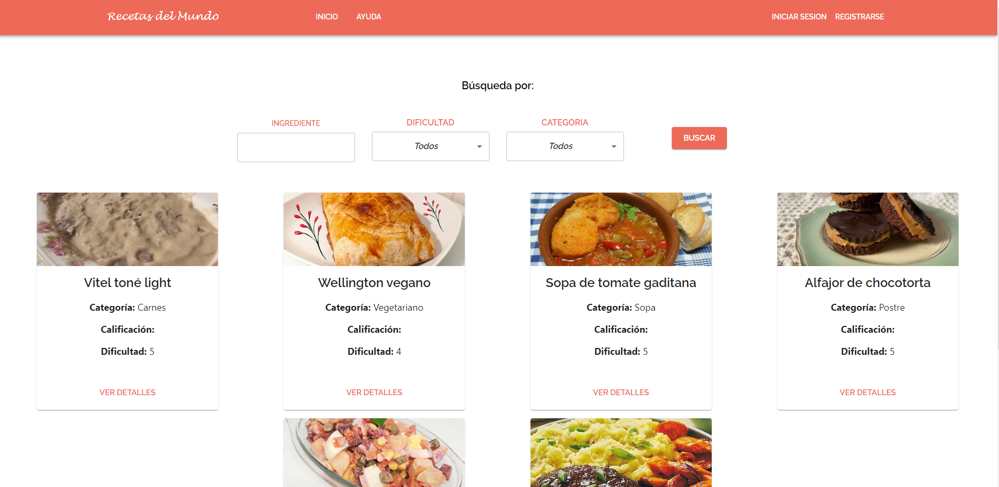
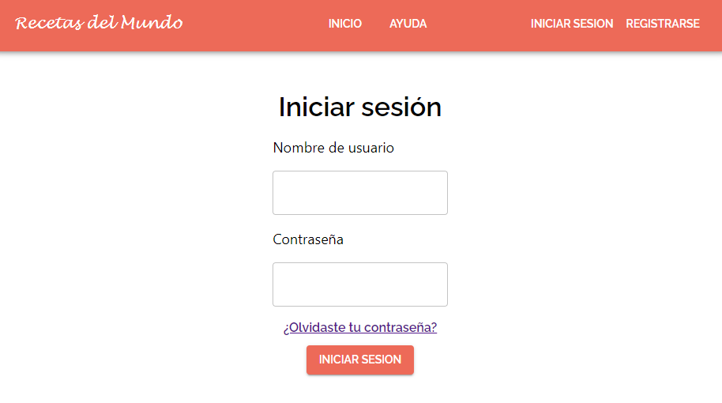
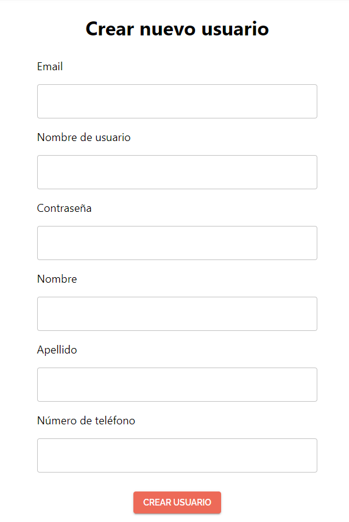
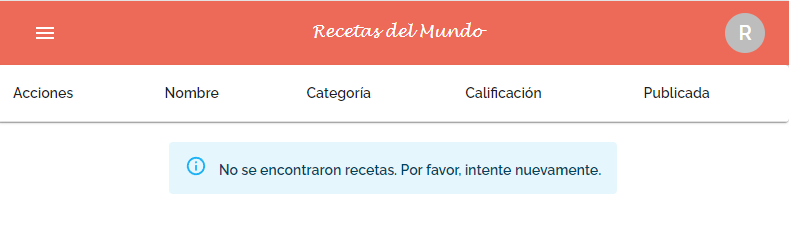
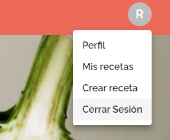

# Recetas del Mundo

# Tabla de Contenidos
1. [Introducción](#Introducción)
2. [Requerimientos](#Requerimientos)
3. [Instalación](#Instalación)
3. [Screenshots](#Screenshots)

## Introducción

La aplicación permite registrarse e iniciar sesión, así como también visualizar recetas, navegar a sus detalles y 
calificarlas, y subir recetas propias.

En la sección "Ayuda" se podrá visualizar una guía de lo que el usuario puede realizar en la aplicación.

Al clickear sobre el botón "Crear receta", se pide llenar un formulario con datos sobre la receta, y, luego de 
confirmar, se la guarda. La receta puede o no ser publicada para que los demás usuarios la puedan ver, dependiendo 
de lo que elija el usuario. Se podrá ver el listado de recetas subidas a la web en "Mis recetas", donde el usuario podrá 
eliminarlas o editarlas cuando quiera.

También, en "Perfil", el usuario podrá editar sus datos, incluyendo la contraseña.
Si el usuario olvida su contraseña, puede recuperarla con su nombre de usuario; le llegará un correo a la dirección de 
email con el que registró la cuenta con una contraseña provisoria.

La aplicación funciona conectándose con una API REST construida con NodeJS y MongoDB, llamada "back-recipes-app.

## Requerimientos
La aplicación fue construida en el sistema operativo Linux con el lenguaje de programación Javascript, empleando el
framework React, y junto con las tecnologías HTML y CSS.

Se recomienda usar una versión de Node.js no anterior a la 16.14, debido a que esa fue la utilizada en el proyecto.

La instalación se puede realizar con el manejador de paquetes NPM, aunque también debería ser posible utilizar Yarn.
Se recomienda también utilizar NVM, el manejador de versiones de Node.js, para poder tener instaladas distintas
versiones en la misma computadora.

Para su desarrollo, es recomendable tener conocimientos de todas las tecnologías mencionadas.

## Instalación


Para instalar el proyecto, no hay que hacer más que ejecutar el siguiente comando:

```
npm install
```

Para iniciar la aplicación, se puede ejecutar el siguiente comando en la terminal:

```
npm run start
```

Al correr el comando, se abrirá una pestaña del navegador en el puerto 3000. La URL de la aplicación es: 
`http://localhost:3000`

Entre las dependencias que contiene el proyecto, se mencionan algunas de las más importantes:

`react`, y `react-dom` y `react-router-dom`: para utilizar la tecnología React.

`mui/material` y `mui/icons-material`: para utilizar los elementos proveídos por https://mui.com/.

## Screenshots

Home



________________
Login                      |  Registro
:-------------------------:|:-------------------------:
  |  

________________
Listado de recetas subidas por el usuario



________________
Opciones para usuario con sesión iniciada


